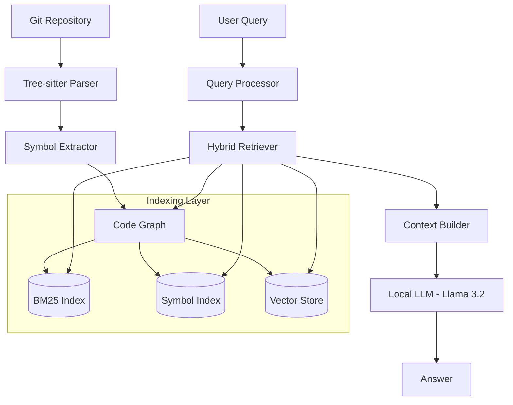

# 🌌 CodeGraph RAG

[](https://ollama.com)
[](https://github.com/dhiraj-rajput/codegraph)
[](https://python.org)

**CodeGraph RAG** is a high-performance, local-first retrieval augmented generation system designed specifically for deep codebase understanding. It moves beyond simple vector search by combining **Symbolic Analysis**, **Graph Relationships**, and **High-Concurrency Indexing** to provide LLMs with perfect architectural context.

---

## 🚀 Key Features

### ⚡ Self-Healing Turbo Mode
Our indexing engine is built for speed and reliability.
- **High Concurrency**: Automatically utilizes your full CPU core count for parallel embedding generation.
- **Self-Healing Batching**: Intelligent recursive auto-scaling. If a local Ollama server times out under pressure, the engine automatically shrinks and retries batches to ensure 100% ingestion completion.

### 🧠 Hybrid Multi-Index Retrieval
CodeGraph doesn't rely on luck. It uses **Reciprocal Rank Fusion (RRF)** to combine three powerful signals:
1. **Vector (Semantic)**: Captures the "intent" of your query using `nomic-embed-text-v2-moe`.
2. **Symbolic (Exact)**: Direct lookups for classes, methods, and variables identified by Tree-sitter.
3. **Graph (Relational)**: Expands context by traversing the dependency graph (Calls, References, Definitions).

### 📊 Beautiful Developer Experience
- **Interactive Dashboard**: View repository health, symbol distributions, and graph density in a premium terminal interface.
- **Tree Visualization**: Explore the symbolic hierarchy of any repository with the `tree` command.
- **Integrated Benchmarking**: Built-in ablation studies to compare retrieval performance (Recall@K) between Standard and Hybrid methods.

---

## 🏗️ System Architecture



---

## 🛠️ Setup & Installation

### Prerequisites
- [Ollama](https://ollama.com) installed and running.
- Python 3.10+

### 1. Install Dependencies
We recommend using `uv` for lightning-fast setup:
```powershell
pip install -r requirements.txt
```

### 2. Pull Required Models
```powershell
ollama pull nomic-embed-text-v2-moe
ollama pull llama3.2
```

---

## 📖 Quick Start

### 1. Ingest a Repository
Turbo-charge your local index. High-concurrency workers will automatically spin up based on your CPU cores.
```powershell
python main.py ingest repos/fastapi --name fastapi --vector
```

### 2. Check Repository Health
View the beautiful Rich-powered dashboard.
```powershell
python main.py stats --repo fastapi
```

### 3. Query the Code
Get deep architectural answers with graph-augmented context.
```powershell
python main.py query "How does FastAPI resolve dependencies?" --repo fastapi --strategy hybrid --llm
```

### 4. Run Benchmarks
Verify the superiority of Hybrid retrieval on your local machine.
```powershell
python main.py benchmark --repo fastapi
```

---

## 📂 Project Structure
- `graph_builder/`: Core Logic for building the symbolic relationship graph.
- `indexer/`: High-concurrency indexing engine for BM25 and Vectors.
- `retriever/`: Multi-strategy retrieval pipelines (Vector, Vectorless, Hybrid).
- `evaluation/`: Automated metrics and ablation study framework.

---

## 📜 License
MIT License. High-performance RAG for everyone.
